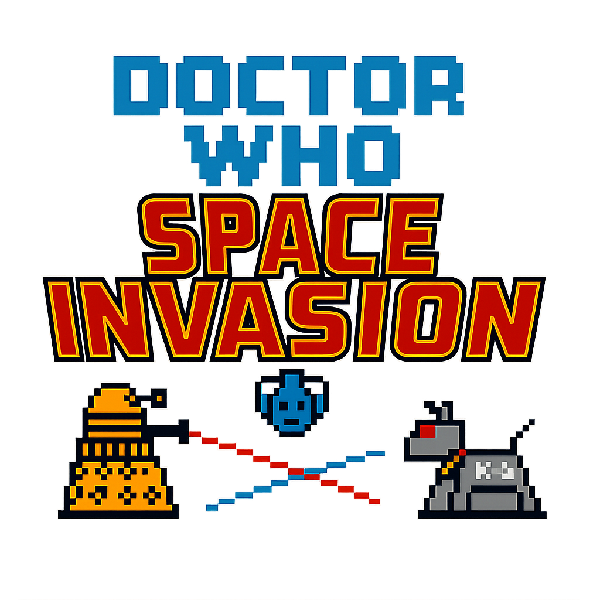

# Doctor Who Space Invasion

A Space Invaders-style arcade game featuring iconic Doctor Who characters, developed as part of the COM4023 CW1 Assignment using Python and Pygame.

<p align="center">
  
</p>

---

## Quick Start

```bash
# Clone the repository
git clone https://github.com/RobsonHarrison/com4023Cw1Pygame.git
cd com4023Cw1Pygame

# Install Pygame
pip install pygame

# Run the game
cd pyGame
python doctorWhoSpaceInvasion.py
```

---

## Documentation

For detailed information, please visit the **[Wiki](https://github.com/RobsonHarrison/com4023Cw1Pygame/wiki)**:

- **[Home](https://github.com/RobsonHarrison/com4023Cw1Pygame/wiki/Home)** - Game overview, controls, and how to play
- **[Game Architecture](https://github.com/RobsonHarrison/com4023Cw1Pygame/wiki/Game-Architecture)** - Technical architecture and design patterns
- **[Sources and Credits](https://github.com/RobsonHarrison/com4023Cw1Pygame/wiki/Sources-and-Credits)** - Attribution for libraries and assets

### Assignment Documentation

- **[Assignment Presentation](documentation/com4023ProgrammingConceptsCw1AssignmentPresentation.pptx)** - Project presentation slides
- **[Assignment Brief](documentation/com4023Cw1AssignmentBrief2025-26.pdf)** - Original assignment requirements

---

## Project Structure

```
com4023Cw1Pygame/
├── pyGame/                          # Main game directory
│   ├── doctorWhoSpaceInvasion.py   # Main game file
│   ├── startScreen.py              # Start screen module
│   ├── gameOverScreen.py           # Game over screen module
│   ├── background.py               # Background animation module
│   └── assets/                     # Game assets (sprites, logo)
└── documentation/                   # Course documentation
```

---

## Team

- **Robson Harrison** - [@RobsonHarrison](https://github.com/RobsonHarrison)
- **Abdul-Mateen Ahmed** - [@abdulmateenahmed02-dot](https://github.com/abdulmateenahmed02-dot)

---

## Course Information

**Module**: COM4023 Programming Concepts
**Assignment**: CW1 Project
